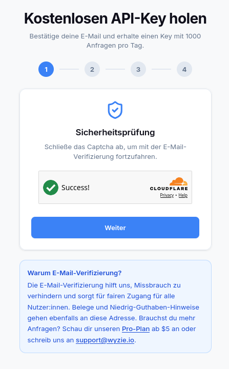
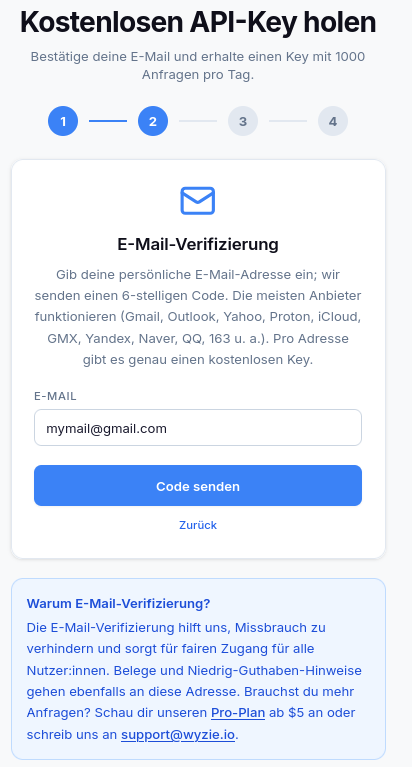
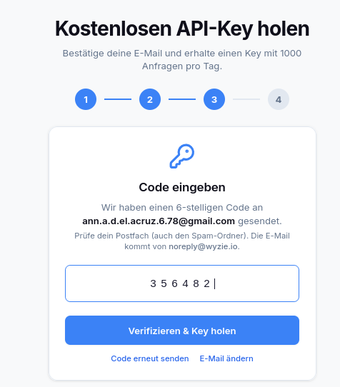
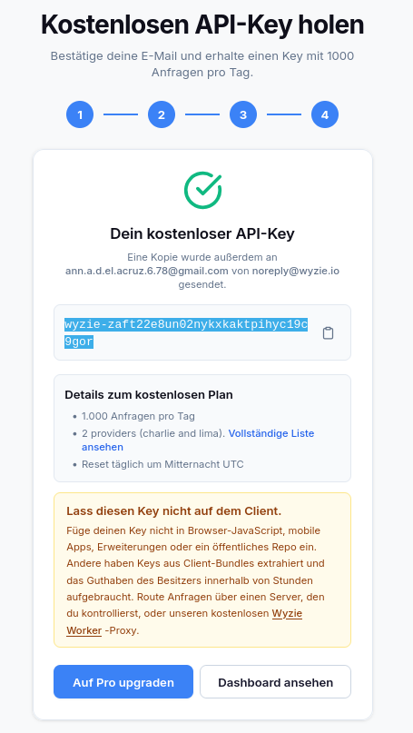
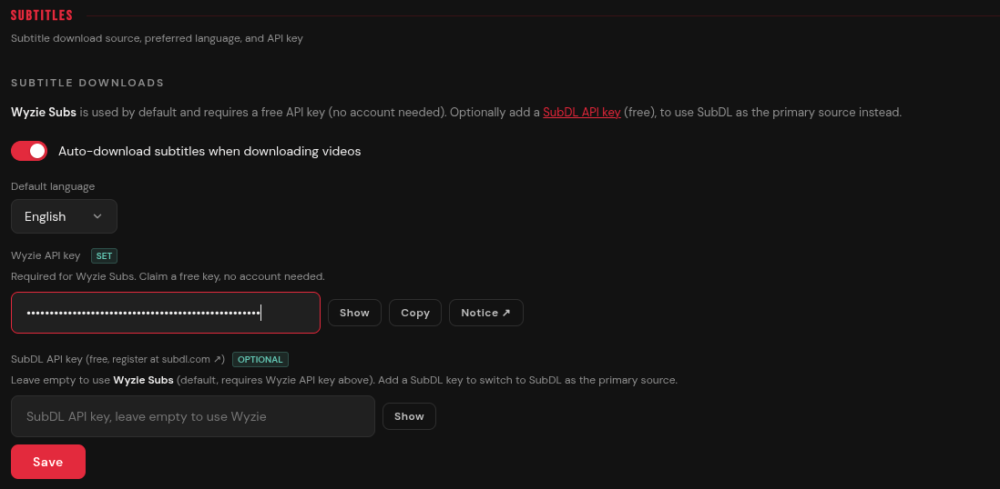

# How to get a wyzie-subs API key

This guide takes ~2 minutes. You'll need a valid email address.

---

## 1. Go to the wyzie website
Open https://store.wyzie.io/redeem in your browser.



---

## 2./3. Verify your email
Enter your email address and wait until you get a code in your Inbox. Then enter that code on the website.




---

## 4. Get your API-key
Copy the key starting with ```wyzie-``` that should show up now.



After that, just paste it into streambert.



---

## Something not working?

If this guide is outdated or you're running into any issues, please [open an issue](https://github.com/truelockmc/streambert/issues/new) on GitHub.